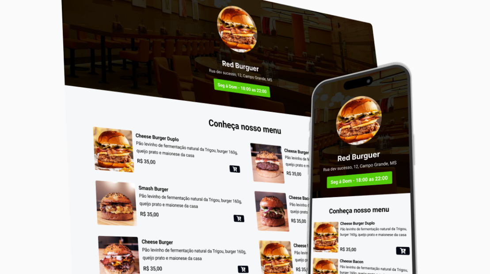

[click no link do projeto.](https://malinhodev.github.io/cardapio-online/)

# 📋 Cardápio online with WhatsApp Integration (integrado a API do whatsapp)

Bem-vindo ao repositório do **Cardápio online**, um projeto simples de um cardápio online desenvolvido com HTML5, CSS3, e JavaScript. Este projeto utiliza a API do WhatsApp para permitir que os usuários façam pedidos diretamente pelo WhatsApp, e a biblioteca **Toastify JS** para fornecer notificações elegantes.

## 📂 Estrutura do Projeto

- `index.html`: Página principal do cardápio online.
- `styles.css`: Arquivo CSS com o estilo do cardápio.
- `app.js`: Arquivo JavaScript para a lógica do projeto, incluindo a integração com o WhatsApp e Toastify.
- `images/`: Pasta que contém as imagens dos pratos.
- `assets/`: Pasta para outros recursos, como ícones.

## 🛠️ Tecnologias Utilizadas

- **HTML5**: Estrutura básica da aplicação.
- **CSS3**: Estilização da interface do cardápio.
- **JavaScript**: Funcionalidade do cardápio e integração com a API do WhatsApp.
- **Toastify JS**: Biblioteca para exibir notificações.
- **Visual Studio Code (VSCode)**: Ferramenta de desenvolvimento.

## 🚀 Funcionalidades

- **Visualização do Cardápio**: Navegue pelos itens do cardápio com imagens e descrições detalhadas.
- **Pedido via WhatsApp**: Clique em um item do cardápio para iniciar uma conversa no WhatsApp com o pedido pré-formatado.
- **Notificações**: Notificações instantâneas usando Toastify para confirmar a adição de itens ao pedido.

## 📦 Como Executar o Projeto

1. **Clone este repositório**:
   ```bash
   git clone https://github.com/malinhodev/cardapio-online.git

2. **Navegue até o diretório do projeto**:
   ```bash
   cd cardapio-online

3. **Abra o projeto no VSCode**:
   ```bash
   code .

4. **Execute o projeto**:
   - Abra o arquivo `index.html` no navegador para visualizar o cardápio.

## 🔗 Integração com a API do WhatsApp

Para configurar a integração com o WhatsApp, edite o arquivo `app.js` para incluir o número de telefone e o texto do pedido. A URL do WhatsApp será gerada automaticamente.

Exemplo:
```javascript
const whatsappNumber = "seu-numero";
const message = "Olá, gostaria de pedir o seguinte item: ";

## 🎨 Personalização

Você pode personalizar o cardápio ajustando o CSS (`styles.css`) e adicionando novos itens ao HTML (`index.html`). As notificações do Toastify também podem ser personalizadas.

## 🔄 Contribuição

Contribuições são bem-vindas! Sinta-se à vontade para abrir issues, enviar pull requests ou compartilhar sugestões.

## 📝 Licença

Este projeto é licenciado sob a [MIT License](LICENSE).
